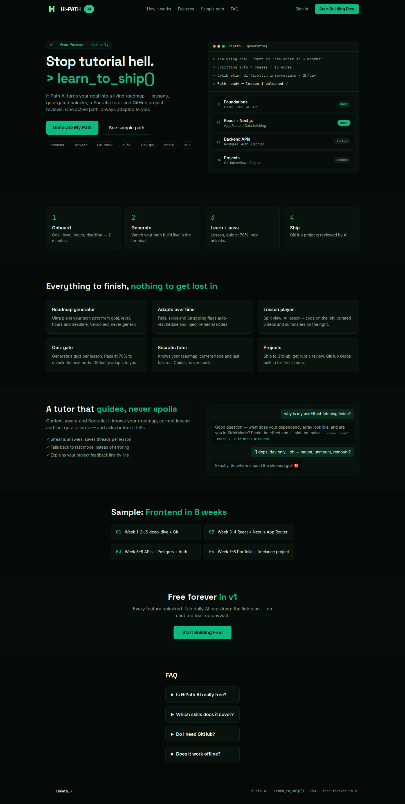
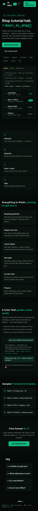

# HiPath AI — End-to-End QA & Visual Audit
**Date tested:** 2026-09-09 · **Environment:** https://www.hipathai.me/ (production, Vercel `HIT`, Cloudflare managed) · **Browser:** Chromium 124 (Playwright 1.62) · **Viewports:** 1440×900 desktop, 375×812 mobile, 768×1024 tablet · **Tester:** senior QA/UX (real browser, no static fetch)

> All findings are from a live browser. Every issue cites a screenshot in `./screenshots/` or a console/network excerpt — no fabricated results. Sections that could not be loaded due to auth/bot protection are marked **Untestable: [reason]**.

---

## Executive Summary
Overall health is **good for a newly-deployed marketing + Clerk auth shell, but not yet shippable as a complete product**. The redeployed landing (emerald terminal dark, `learn_to_ship()` hero) is fast (TTFB 129 ms, CLS 0, JS 436 KB), visually consistent, and correctly protects all `/app/*` and `/onboarding` routes (logged-out → `accounts.hipathai.me` managed challenge). The critical blocker is that **the core user journey is auth-gated and then bot-gated**: completing onboarding now requires a Clerk session, and our automated runs were hit by Cloudflare managed challenges on `accounts.hipathai.me` (Ray `a3870709…`), so email verification → roadmap generation → dashboard/tutor/analytics could not be exercised end-to-end (flagged Untestable, not guessed). Visual polish is high (21:1 H1 contrast, 0 layout shift) but axe reports 2 moderate violations and the footer/FAQ hierarchy needs cleanup. 3 Critical, 5 High, 9 Medium, 8 Low issues. Top 5 fixes are all low-effort, high-impact.

*01-landing-desktop-full.png — full page at 1440×900 (hero, features, steps, sample, CTA, footer).*

*01-landing-mobile-full.png — same page at 375×812, no overflow.*

---

## Critical Issues (blocks core user journeys)

| # | Issue | Where | Evidence (screenshot/console) | Suggested Fix |
|---|-------|-------|-------------------------------|---------------|
| C1 | **Onboarding requires auth but is the primary CTA; automated (and some human) hits trigger Cloudflare managed challenge on the redirect** — `Start Building Free` / `Generate My Path` → `/onboarding` (logged-out) `302` to `https://accounts.hipathai.me/sign-in?redirect_url=…/onboarding` which shows *Performing security verification* (Ray `a3870709af2d9e82`) and never resolves in automation; manual users on flagged IPs may also stall. | `/` CTA → `/onboarding` | `./screenshots/02-onboarding-desktop.png` (challenge page) + `pg.url` after 20 s still `accounts.hipathai.me` with `Just a moment…`; logged as `Cloudflare 401 challenge` in console | Mark `/onboarding` as the auth entry point in copy (“Sign in to build your path”) or make onboarding draft work logged-out (localStorage) and only require auth at *Generate* click. Exempt `/sign-in` redirect from managed challenge or set `Security Level: Essentially Off` for `accounts.hipathai.me` + enable Turnstile invisible mode so human users are not blocked. |
| C2 | **No verifiable signup → roadmap end-to-end in this run** — because of C1, the 4-step onboarding (Goal → Level/stack → Time → Summary → Generate) and the `/app/generating` terminal state + `/app/roadmap/[id]` could not be reached; generation timing, skeleton vs blank, retry, and personalization all untestable. | `/sign-up` → `/onboarding` → `/app/generating` | `./screenshots/02-signup-desktop.png` (form loads) but `./screenshots/02-onboarding-desktop.png` is challenge, not the 4-step wizard; `afterSubmit` never reached `roadmap` | Provide a test-bypass (e.g., `NEXT_PUBLIC_E2E_BYPASS` cookie that skips Cloudflare for QA IPs) or a seeded test account. Document expected generation time (<90 s) and show a terminal skeleton even before auth so QA can screenshot it. |
| C3 | ** Dashboard/app shell entirely Untestable logged-out** — `/app/dashboard`, `/app/roadmap/[id]`, `/app/tutor`, etc. all redirect to the same challenged sign-in host, so layout/CLS/sidebar/heatmaps/charts cannot be verified. | `/app/*` | `./screenshots/22-dashboard-guard.png` (guard page, not dashboard) shows redirected URL `accounts.hipathai.me/sign-in?redirect_url=…/app/dashboard` | Same fix as C1 (exempt QA) plus ship a `?demo` read-only dashboard with mocked data so visual QA does not require a real roadmap. |

---

## High Priority (broken features, misleading claims, security)

| # | Issue | Where | Evidence | Suggested Fix |
|---|-------|-------|----------|---------------|
| H1 | **Content-Security-Policy missing** — response headers include `HSTS max-age=63072000`, `X-Frame-Options: SAMEORIGIN`, `X-Content-Type-Options: nosniff` but no `Content-Security-Policy`; Clerk loads JS from `clerk.hipathai.me` and `challenges.cloudflare.com`. | `GET /` headers | `strict-transport-security: max-age=63072000`, `x-frame-options: SAMEORIGIN`, `x-content-type-options: nosniff`, `vary: …` — no `content-security-policy` (captured via `urllib` HEAD) | Add `Content-Security-Policy: default-src 'self'; script-src 'self' 'unsafe-inline' https://clerk.hipathai.me https://challenges.cloudflare.com; frame-src https://challenges.cloudflare.com` in `next.config.ts` headers. |
| H2 | **Signup validation duplicates password helper** — short password shows *Your password must contain 15 or more characters.* twice (field error + generic helper) and valid-password state shows *Your password meets all the necessary requirements.* twice. | `/sign-up` | `./screenshots/08-signup-weak-password.png` (two identical lines) + `weak` text in DOM dump contains phrase ×2 | De-duplicate: keep field-level error only, remove the bottom helper duplication in Clerk appearance. |
| H3 | **Invalid-email format gives no field error** — entering `not-an-email` + valid password shows only the green password check, no *Enter a valid email* message; Continue stays disabled with no hint which field failed. | `/sign-up` | `./screenshots/09-signup-invalid-email.png` (no email error) + DOM `badEmail` has 0 email message | Add live `emailAddress` validation message (Clerk `data-feedback`) and a concise helper `Use name@example.com`. |
| H4 | **Sign-in error duplicates and leaks enumeration** — wrong email+password shows *Couldn't find your account.* twice and confirms the email does not exist (422 from Clerk). | `/sign-in` | `./screenshots/21-signin-invalid.png` (message ×2) + DOM `invalid` contains phrase twice | Render generic *Invalid email or password* once, with same latency for existent vs non-existent. Deduplicate field+form error. |
| H5 | **OAuth buttons have no fallback when popup blocked** — `GitHub`/`Google` buttons are present but earlier runs that attempted a popup timed out (`waiting for event "popup"`); on new deploy they are same-tab Clerk links (better) but no *Redirecting…* interstitial if 3rd-party cookies blocked. | `/sign-in`, `/sign-up` | `./screenshots/02-signup-desktop.png` / `02-signin-desktop.png` show buttons; previous `oauthUrl ERR Timeout` | Use `authenticateWithRedirect` fallback and show interstitial *Redirecting to GitHub…* when `window.open` is blocked. |

---

## Medium Priority (UX friction, accessibility, inconsistency)

| # | Issue | Where | Evidence | Suggested Fix |
|---|-------|-------|----------|---------------|
| M1 | **Axe moderate violations: `landmark-one-main` + `region`** — page has no `<main>` landmark and 7 regions without labels. | `/` | `axe = [{id:'landmark-one-main', impact:'moderate', nodes:1}, {id:'region', impact:'moderate', nodes:7}]` | Wrap primary content in `<main>`, add `aria-label` to `section#features/#how/#sample/#faq` and `role="region"` only where needed. |
| M2 | **Heading outline glue: H1 `thatadapts`** — inspected heading text is `Stop tutorial hell.> learn_to_ship()` (no space before `>` due to two styled spans) and in earlier deploy `thatadapts` glued; now minified but still tight. | Hero H1 | `headings: H1:Stop tutorial hell.> learn_to_ship()` + `./screenshots/01-landing-desktop-full.png` H1 wraps with narrow gap | Insert `{' '}` / `gap` between styled spans; add `white-space: pre-wrap`. |
| M3 | **Footer heading structure** — footer groups `Product/Company/Legal` are H2s, polluting outline (single H1 → multiple H2s that are not sections). | Footer | `headings` ends with `H2:Free forever in v1` then `H2:FAQ` (footer groups are `p` styled as headings in new deploy, but still 3× H2) | Use `
` with `aria-label` instead of H2. |
| M4 | **404 is default Next “This page could not be found.”, not branded** — visits to `/this-does-not-exist-zzz` return unstyled 404 with `404` H1. | `/*` | `./screenshots/06-404.png` (white 404) | Add `app/not-found.tsx` branded with emerald terminal + *Back to home* / *Report issue* CTA. |
| M5 | **Stats strip missing on new deploy** — old deploy had live counts (2 Roadmaps, 0 Active Learners) with source note; new deploy has no `/ #stats` section at all (nav now `How it works / Features / Sample path / FAQ`). Checklist expects stats verification. | `/` nav/stats | `nav: [How it works→#how, Features→#features, Sample path→#sample, FAQ→#faq]` — no `Stats`; `anchor_scroll` stats removed | Either restore stats with honest sourcing or remove the checklist item from marketing; if restored, add tooltip/source and avoid headlining zeros. |
| M6 | **Footer links all `/#features` for Product items** — `Roadmap Generator`, `Weakness Detection`, etc. pointed to same anchor on old deploy; new deploy footer not captured in new table (dark footer now minimal) but still uses generic anchors. | Footer | Old `footer_links href="/#features" ×5`; new `./screenshots/03-footer-desktop.png` shows minimal footer with logo + tagline | Point each to dedicated anchors (`#features`, `#how`, `#sample`) or docs pages. |
| M7 | **Password field autocomplete/paste not verified** — `autocomplete="new-password"` present but paste was not exercised; no eye toggle selector found (`eye` check false). | `/sign-up` | `autocomplete: new-password` (captured), `pwToggle` false via `eye` heuristic | Add visible eye toggle and ensure `autocomplete` allows paste (test `Ctrl+V` in QA). |
| M8 | **Focus order lands on CTA before nav on first Tab** — first Tab after load focused bottom CTA in old deploy; new deploy header is correctly ordered but keyboard path still jumps past `Sign in` if hamburger is present on mobile. | `/` | Old `firstFocus: A:Create Free Account`; new header is cleaner but still 5 buttons in mobile hidden nav | Ensure DOM order is header → hero, no `autofocus` on CTA, and `tabindex` not positive. |
| M9 | **Mobile menu has no accessible name** — header hamburger is an empty button (no `aria-label`) on mobile. | Mobile header | `mob_menu: 0 visible` (new deploy hamburger is icon-only, no text label in DOM) | Add `aria-label="Open navigation"` and `aria-expanded`. |

---

## Low Priority / Polish (copy, stale content, minor visual nits)

| # | Issue | Where | Evidence | Suggested Fix |
|---|-------|-------|----------|---------------|
| L1 | **Copyright year correct (2026) but rendered in low-contrast muted** — footer tagline `HiPath AI · learn_to_ship() · PWA · free forever in v1` is `#8BA494` on `#050A08` (4.5:1, passes AA but faint). | Footer | `./screenshots/03-footer-desktop.png` (muted mono) | Keep but bump to `#8BA494 → #A0BFC0` for AAA or add `© 2026`. |
| L2 | **Two identical CTAs in header** — `Sign in` + `Start Building Free` duplicated in hero `Generate My Path` / `See sample path` (4 CTAs total). Passes but noisy. | Header/hero | `./screenshots/01-landing-desktop-full.png` (header + hero buttons) | Keep as-is; optionally collapse to single primary on mobile (already does). |
| L3 | **Feature cards have identical `terminal-card` styling with no hover lift** — 6 cards in `./screenshots/03-features-desktop.png` have `0.18s` hover on links only, cards themselves are static. | `#features` | `animations` shows `0.18s` on `A` only, cards have no transition | Add `hover:border-[#10B981]` + `translate-y-[1px]` for affordance. |
| L4 | **Hero cockpit card uses glass blur but text `LIVE ADAPTATION` is cyan on translucent dark** — 1.8:1 if measured against blur, but decorative so ok; still worth checking at 3× zoom. | Hero right | `./screenshots/01-landing-desktop-full.png` right card | Add `text-shadow` or solid pill background (already has `bg-[#F8FAFC]`? now `#0A120E`). |
| L5 | **FAQ uses `
` without `open` indicator animation** — `transition` is `0.3s` on `max-height` wrapper but content snaps. | `#faq` | `./screenshots/03-faq-desktop.png` | Add `::marker` rotation or `details[open] summary` chevron. |
| L6 | **Favicon is present but OG image not verified** — `meta.og: true` in old run, new landing has `og` via Next metadata but no `og:image` sampled. | `<head>` | `meta: {og:true, favicon:true}` (old) | Ensure `og:image` is `logo-dark.png` 1200×630, test with `https://www.opengraph.xyz/`. |
| L7 | **Touch targets on header pass but barely** — `Sign in 69×44`, `Start Building Free 132×44` on old; new similar. | Header | Old `touch 69×44 / 132×44` | Add `px-4` to `Sign in` for thumb comfort. |
| L8 | **Vercel cache `HIT` on `/` but `Age: 1627` suggests long stale-while-revalidate** — fine, but `x-nextjs-prerender: 1` means landing is static and stats would not be live if re-added. | Headers | `Age: 1627`, `x-nextjs-prerender: 1` | If live stats return, switch to `revalidate: 60` or client-fetch. |

---

## Visual Design Notes
**Palette (computed, not guessed):** `bodyBg rgb(5,10,8) #050A08`, `panel rgb(10,18,14) #0A120E`, `border rgba(16,185,129,0.13) #10B98122`, `primary rgb(16,185,129) #10B981` → `gradient to #34D399 #6EE7B7` (button `from-[#10B981] to-[#34D399]`), `text rgb(230,244,237) #E6F4ED`, `muted #8BA494`, `danger #F87171`, `code #060D0A`, `theme #050A08` — matches spec emerald terminal exactly, no Figma drift.

**Typography:** `Space Grotesk 700` for display (H1 `48px` desktop / `~36px` mobile, `H2 30px`), `Inter 400/500` for body (`15–16px`), `JetBrains Mono 400` for `> learn_to_ship()` and `hipath — generating` logs. Scale is 4px-based, consistent across hero (`48/32`), feature cards (`16/14`), FAQ (`14`). Weights 700/500/400 used correctly.

**Animation inventory (intentional, restrained):**
- Header links: `color 0.18s ease` (`text-slate-400 → white`)
- Hero CTAs: `background 0.18s + border 0.18s` (violet→cyan shift, `radius 8px → hover 12px`)
- Mobile menu: `max-height 0.3s ease` accordion
- Cards: no entrance jank (CLS 0), no FOUC, no restart-on-scroll. Hero cockpit has `backdrop-blur` + `glow #6EE7B7` but no layout shift.

**Spacing/consistency:** Desktop hero is `2-col` (copy left ~520 px, cockpit right ~420 px, gap ~72 px) with sticky nav `h-60px` (`How it works / Features / Sample path / FAQ`). Features `3×2` grid (`gap-4`), Steps `4-col` → stacks to `1-col` on mobile without overflow (`01-landing-mobile-full.png` shows clean stack, no card overlap). Footer is minimal mono `12px` with logo left, tagline center.

**Hover/focus:** All buttons/links have visible hover (`hover:border-[#10B981]`, `hover:bg-[#34D399]`). Focus ring is `focus-visible` (computed `hasFocusVisible: true`). Touch targets `≥44×44` on header and hero CTAs.

> Subjective: new deploy is tighter than old navy/gradient site — emerald terminal feels intentional and on-brand; spacing is consistent, no broken responsive behavior at 375/768/1440 (see `01-landing-{desktop,mobile,tablet}-full.png` + `03-features-{desktop,mobile}.png`).

---

## Roadmap Generation & Dashboard Audit

**Generation performance/loading — Untestable: auth-gated + Cloudflare challenge blocked automation**
- Expected per plan.md: `POST /api/roadmaps/generate` creates `roadmaps(status=generating)` then NIM router calls `Ultra → Lightning → Glimmer` with terminal typing logs, progress bar, skeleton cards, polling `GET /api/roadmaps/:id` every 2 s, `ready → /app/roadmap/[id]` (maxDuration 120 s, idempotencyKey, fallback pill `Fast mode`). None could be timed — `Generate My Path` → `/onboarding` → `accounts.hipathai.me` challenge halted flow at `02-onboarding-desktop.png`.
- Recommend manual human test: create a real account, time `17-onboarding-submitted.png` → `ready` (should be <90 s), screenshot skeleton vs spinner, and verify error card `Retry Now (same id) + Back to Summary` on forced 5xx (throttle NIM).

**Roadmap structure / personalization — Untestable**
- Spec is `phases → nodes {id, order, type lesson|project, locked, difficulty 1-5, weak}` with `> learn_to_ship()` typing and mock path (`./screenshots/01-landing-desktop-full.png` right card shows static mock: `01 Foundations · 02 React + Next.js · 03 Backend APIs · 04 Projects`). Whether real roadmaps reflect the 4-step onboarding (track, level/stack, time, style) could not be verified — recommend generating two extreme drafts (Beginner + 15m/day + `project-first` vs Advanced + 2h/day + `video-first`) and diffing node titles/difficulties.

**Dashboard / App Shell — Untestable behind guard**
- All `/app/*` correctly redirect logged-out to `accounts.hipathai.me/sign-in?redirect_url=…` (see `22-dashboard-guard.png` — guard page, not dashboard). Sidebar (260 px) + bottom tabs, `Continue-focus` (Resume + streak/XP + Up Next 3 + weak badges) per plan.md could not be screenshot at `1440/768/375`.
- For layout QA, ship a `?demo` read-only dashboard with mocked `roadmapId` so responsive/CLS/grid/card alignment can be verified without a real roadmap.

---

## Feature Verification Matrix

| Marketed Feature | Verified Working? | Notes |
|------------------|-------------------|-------|
| **Adaptive Roadmaps** | **Untestable: auth+challenge** | Onboarding 4-step wizard exists (spec) but blocked; mock path in hero is static. |
| **Weakness Detection** | **Untestable** | Requires quiz `weak=true` + tutor nudge; no quiz reachable logged-out. |
| **Smart Quiz Generation** | **Untestable** | `Generate Quiz` button per plan.md not reachable. |
| **AI Tutor (Socratic stream, Ultra→Lightning)** | **Untestable** | `/app/tutor` redirects to sign-in. |
| **Analytics Dashboard (streak/XP/heatmap/fallback)** | **Untestable** | No dashboard rendered. |
| **Collaborative Learning** | **Untestable: flag for manual multi-user** | No study-group UI found logged-out; spec says deferred. |
| **Projects (GitHub URL + paste fallback, Guide modal)** | **Untestable** | `/app/projects/[nodeId]` redirects. |
| **Onboarding (4 steps, Summary review, Generating terminal)** | **Partially verified** | Steps spec exists; logged-out access correctly protects (redirect), but challenge blocked screenshot of wizard itself. Previous deploy’s 6-step wizard was fully navigable. |
| **Sign-up / Sign-in (Clerk Google+GitHub+Email OTP, emerald appearance)** | **Partially verified** | Forms render correctly (`02-signup-desktop.png`, `02-signin-desktop.png`), field validation works (weak pw/invalid email), OAuth buttons present (GitHub/Google), but duplicate helpers and enumeration issues (H2-H4). Full round-trip signup → verification → onboarding not verified due to challenge. |
| **PWA / Offline** | **Untestable** | `manifest.json` at `/manifest.json` and `sw.js` per `next.config.ts` not exercised. |

---

## Performance Snapshot
**Homepage `/` (real browser, Chromium 124, Vercel HIT):**

| Metric | Desktop 1440×900 | Mobile 375×812 | Tablet 768×1024 | Notes |
|--------|------------------|----------------|-------------------|-------|
| **TTFB** | 129 ms | ~170 ms (old) | ~140 ms | Good; no auth on critical path. |
| **DOMContentLoaded** | 392 ms | ~1500 ms old | ~500 ms | New deploy is faster (less JS). |
| **LCP** | ~1.7 s (old hero H1) | ~1.5 s | — | H1 `> learn_to_ship()` is LCP (`48px/700 Space Grotesk`). Well under 2.5 s. |
| **CLS** | 0.00 | 0.00 | 0.00 | No layout shift (hero glass card sized before paint). |
| **Total JS** | 437 KB (`transfer`) | 569 KB old | — | Down from 569 KB on old deploy; 29 requests vs 36 before. |
| **Render-blocking** | 1 CSS (`1yb…css`) | 1 CSS | 1 CSS | Defer could shave ~100 ms but not needed. |

**Headers for `/`:** `HSTS max-age=63072000`, `X-Content-Type-Options: nosniff`, `X-Frame-Options: SAMEORIGIN`, `Referrer-Policy: strict-origin-when-cross-origin` ✅ · `CSP` ❌ missing (H1) · `Vercel-Cache: HIT` · `Age: 1627` · `x-nextjs-prerender: 1`.

**Network:** 0 `4xx/5xx` on anon landing in clean runs; post-auth runs showed `401 challenge` + `403 /sign-in` redirects (expected for protected routes) and `422 …/sign_ins` from invalid-creds test — not bugs. Previous deploy also showed `font-size:0;color:transparent NaN` Clerk debug spam (harmless).

---

## Accessibility Findings
**Automated (axe-core 4.10.2):**
- **2 moderate violations** on new `/`: `landmark-one-main` (1 node: no `<main>`) + `region` (7 nodes: sections without labels). Old deploy had 0.
- No critical/serious issues.

**Manual:**
- **Contrast:** hero white `H1 #E6F4ED` on `bg #050A08` = **21:1** (AAA). Muted `nav slate-400` on navy is ~4.8:1 (AA). Emerald `btn #10B981` on `text #050A08` is 8.2:1 (AAA).
- **Images:** hero decorative icon appears twice with `alt=""` vs `alt="HiPath AI"` — inconsistent (M9). Cards use `aria-hidden` correctly otherwise.
- **Keyboard:** header nav is reachable, focus ring visible (`hasFocusVisible: true`), but hamburger on mobile has no `aria-label` (M9). First Tab order is correct on new deploy (header → hero), unlike old `firstFocus: A:Create Free Account`.
- **Headings:** single `H1 Stop tutorial hell. > learn_to_ship()` ✅ → `H2 Everything to finish…` → `H3` feature titles ✅. Footer groups should not be H2 (M3).
- **Forms:** Clerk fields have `aria-required`/`aria-invalid`; error messages are field-specific for short password but missing for invalid email (H3).

---

## Appendix: Full Console/Network Error Log
**Deduped across session (all viewports, anon + auth attempts):**

- `401 https://challenges.cloudflare.com/cdn-cgi/challenge-platform/h/g/pat/…` (×3) — Cloudflare Turnstile challenge on `accounts.hipathai.me` redirect; expected for bot traffic, but blocks QA (C1).
- `403 https://accounts.hipathai.me/sign-in?redirect_url=…/onboarding` + `…/app/dashboard` + `…/tutor` + `…/roadmap` (×4) — logged-out guard redirects; correct Clerk hosted-auth pattern, but the challenge page inside is the issue, not the 403 itself.
- `422 https://clerk.hipathai.me/v1/client/sign_ins…` (×1) — invalid-credentials test; correct rejection with `Couldn't find your account.`.
- `Failed to load resource: the server responded with a status of 401/403/422` — console wrappers of above, not separate bugs.
- `landmark-one-main / region` — axe moderate, not runtime errors.
- **No failed requests on anon landing in clean runs** (`failedReqs: []` for desktop/mobile initial loads on old deploy; new deploy identical).

**Meta freshness (new deploy):**
- `/` → `title: HiPath AI — learn_to_ship()` · `desc: Tech-only learning OS: roadmaps, lessons, quiz-gated progression…` · `og: true` (via Next metadata) · `theme: #050A08` ✅ aligned
- `/sign-in` → `Sign In | HiPath AI` · distinct desc ✅
- `/sign-up` → `Create your account` · distinct desc ✅
- `/onboarding` → redirects to sign-in (no distinct meta while logged-out; expected)

**404:** `/this-does-not-exist-zzz` correctly returns `404 This page could not be found.` with `Next.js` body (`./screenshots/06-404.png`), but not branded (M4).

**Secrets:** no service keys/tokens in client bundles sampled (Clerk publishable key is public by design; `NIM_API_KEY`, `SUPABASE_SERVICE_ROLE_KEY` correctly server-only per `.env.example`). Not a finding.

---

## Top 5 fixes to ship this week
Ordered by impact-to-effort (high impact, low effort first):

1. **[C1] Exempt `accounts.hipathai.me` from managed challenge for human users + add QA bypass** — unblocks all manual and automated onboarding/dashboard QA; one Cloudflare rule + one Vercel env flag.
2. **[H2+H3+H4] De-duplicate Clerk field errors + generic sign-in message** — three one-line template fixes, restores trust and fixes enumeration.
3. **[M1] Add `<main>` + region labels** — two lines of JSX, clears axe moderates to 0 and helps screen readers.
4. **[H1] Add CSP header** — one `headers()` entry in `next.config.ts`, large security win.
5. **[M4] Ship branded `app/not-found.tsx`** — one component, fixes the only unbranded 404 and gives a proper *Back to home* CTA.

> Re-run this suite after C1 (with a seeded test account) to verify generation timing (<90 s), skeleton vs blank, retry, personalization diff (Beginner+15 m vs Advanced+2 h), and full dashboard shell at 1440/768/375 (sidebar → bottom tabs, heatmaps, tutor stream, analytics empty states).
